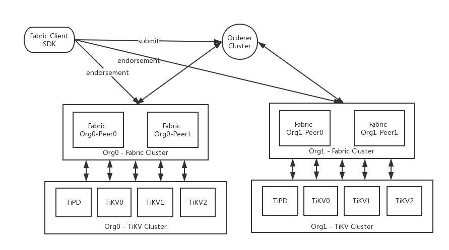

# TiKV for Hyperledger/Fabric

Hyperledger/Fabric是由Linux基金会发起的推进区块链与分布式账本的开源项目。
目前Fabric Peer节点将节点所在链上账本数据保存在本地LevelDB或CouchDB中。
TiKV作为最新基于Google Spanner设计的分布式KV系统，具有极佳的性能与扩展性，很符合区块链账本的存储需求。

本项目演示如何采用TiKV保存peer节点的账本数据。

## 部署架构介绍

Fabric与TiKV的部署架构如下图所示：



在基于levelDB的Fabric部署中，每个Peer都在本机保存账本。在基于TiDB的Fabric部署中，一个Org中的所有Peer可以共享一个TiDB集群。

## 环境准备

TiKV集群环境建议配置PD和TiKV两个集群，同时Fabric服务也可以共享TiKV服务器。
共采用六台主机组成集群，其中前三台作为TiKV PD集群，同时Fabric Peer节点也通过Docker容器方式部署在上面，后三台作为TiKV集群，Fabric Orderer也通过Docker容器方式部署在其中一台。

| 主机名       | IP            | 部署服务       | 数据盘挂载 |
| --------- | ------------- | ---------- | ----- |
| host1 | 192.168.1.101 | PD1 & Fabric-Peer1 | /data |
| host2 | 192.168.1.102 | PD2 & Fabric-Peer2 | /data |
| host3 | 192.168.1.103 | PD3 & Fabric-Peer3 | /data |
| host4 | 192.168.1.104 | TiKV1 & Fabric-Orderer     | /data |
| host5 | 192.168.1.105 | TiKV2      | /data |
| host6 | 192.168.1.106 | TiKV3      | /data |


## 部署TiKV

参考 https://github.com/pingcap/docs-cn 完成TiKV集群的部署。

## 部署Fabric
1）前提条件和系统配置

Docker - v1.12 或更高版本

Docker Compose - v1.8 或更高版本

Go - 1.7 或更高版本

2）获取Fabric Docker Image

```
docker pull wandatech/fabric-orderer:x64_64-1.0.0-tidb
docker pull wandatech/fabric-peer:x64_64-1.0.0-tidb
docker pull wandatech/fabric-ccenv:x64_64-1.0.0-tidb
```
3）获取Fabric代码
```
git clone https://github.com/hyperledger/fabric.git
```
参考http://hyperledger-fabric.readthedocs.io/en/latest/getting_startedv2.html 完成Fabric集群的部署

## 启动Fabric

在启动Fabric之前，修改Fabric Peer的docker-compose文件，添加如下Ledger配置：

```
peer0:
	environment:
		- CORE_LEDGER_STATEDATABASE=tidb
		- CORE_LEDGER_STATE_TIDBCONFIG_PDADDRESS=192.168.1.101:8081
```

然后按照正常流程启动Fabric peer，peer启动之后将自动采用TiKV作为账本存储。
